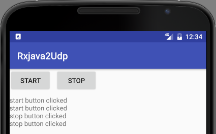

# RxJava2_Udp
[RxJava2](https://github.com/ReactiveX/RxJava/wiki/What's-different-in-2.0) UDP observable example

This is an example project to experiment with RxJava2. The task is to build an Observable that will listen to a UDP port and emit all UDP packets.

see also: [Stackoverflow: RxJava2 how to observe UDP packets?](http://stackoverflow.com/questions/42326667/rxjava2-how-to-observe-udp-packets)

The sample application is very simple.
  
  
  
The [MainActivity](https://github.com/tmtron/RxJava2_Udp/blob/master/app/src/main/java/com/tmtron/rxjava2udp/MainActivity.java) has

- 2 buttons `Start`/`Stop`: when you press them they will send a UDP packet to a local port (writing is done by the [UdpWriter class](https://github.com/tmtron/RxJava2_Udp/blob/master/app/src/main/java/com/tmtron/rxjava2udp/UdpWriter.java)).
- a text-view where the received UDP-data will be appended to.

The [UDP-Observable](https://github.com/tmtron/RxJava2_Udp/blob/master/app/src/main/java/com/tmtron/rxjava2udp/UdpObservable.java) will create the observable that opens the UDP port and emits the data-packets.

